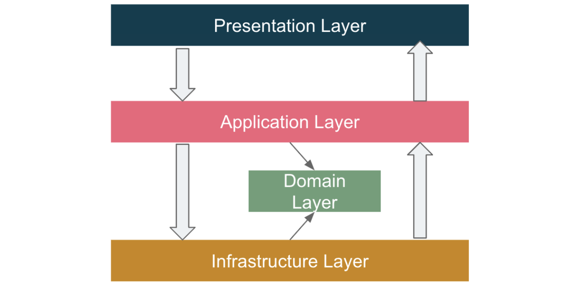
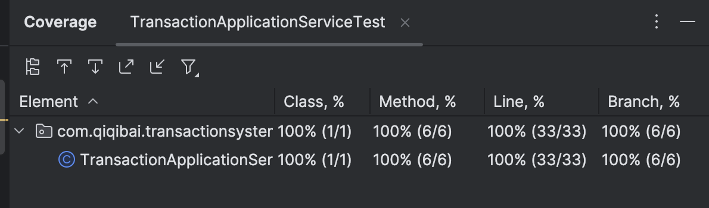

# Required Environment
Java 21

# Architecture
DDD architecture

# External Libraries
Lombok: generate template code   
Junit5: for unit test   
Guava: for local cache and other util classes   

# Test Coverage
The Application layer is 100%
