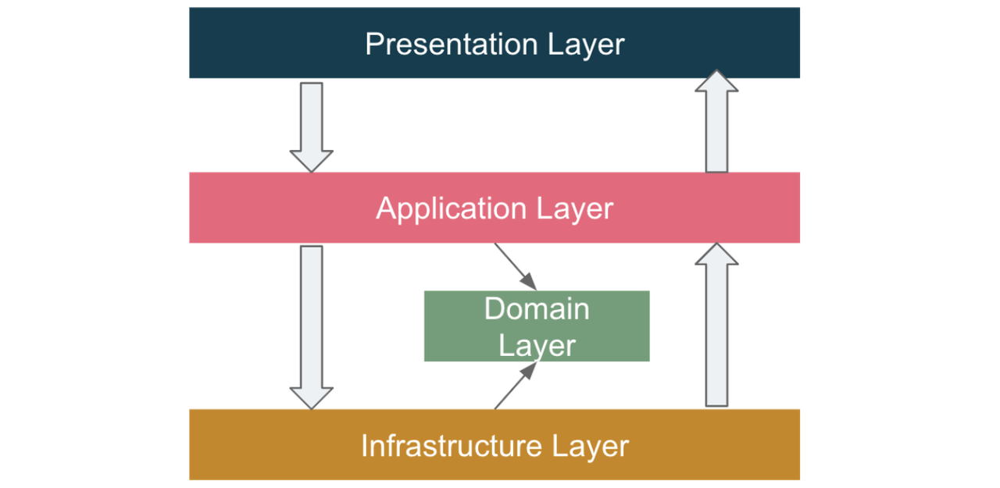
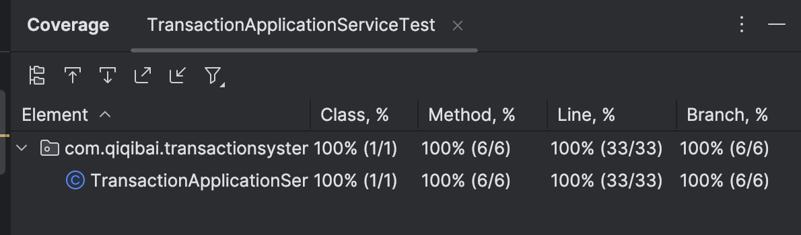
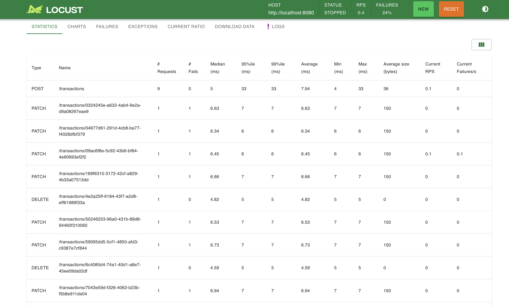

# Architecture
DDD architecture


# Required Environment
Java 21

# How to run locally

```commandline
mvn clean install   
mvn spring-boot:run   
```
# Test Coverage
```commandline
mvn clean test
```
The Application layer is 100%


# Transaction State Machine

Transactions now use an explicit state machine:

- `PENDING` -> `PROCESSING`, `CANCELED`
- `PROCESSING` -> `SUCCEEDED`, `FAILED`, `CANCELED`
- `SUCCEEDED`, `FAILED`, `CANCELED` are terminal states

The API exposes business actions instead of generic status mutation:

- `POST /transactions/{id}/processing`
- `POST /transactions/{id}/success`
- `POST /transactions/{id}/failure`
- `POST /transactions/{id}/cancel`

# Build Docker Image
Provide docker file for pipeline build.

Run docker locally:
```commandline
docker build -t tansaction-system .
```

# External Libraries
Lombok: generate template code   
Junit5: for unit test   
Guava: for local cache and other util classes

# Performance Test
Use Locust to do performance test
```commandline
cd performnace-test
pip install locust
locust -f locustfile.py --host=http://localhost:8080
```

